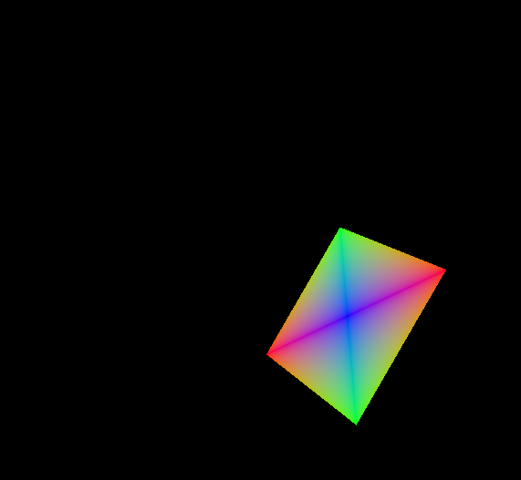
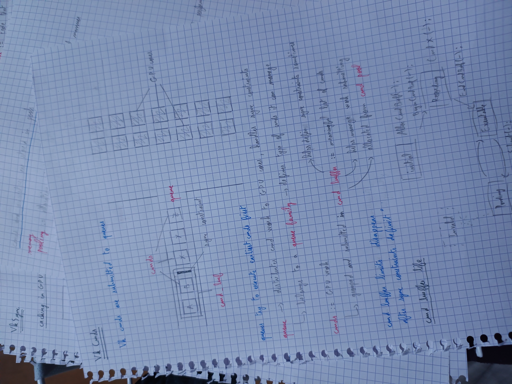

Graphics engine written in Rust using `ash`.

# Progress

**Now** : Working on understanding render pass then repairing eventually the 3D problem.

Currently having a kinda spinning rectangle (It was supposed to be an octahedron..) from following and messing around with the [vulkan-tutorial](https://vulkan-tutorial.com/Vertex_buffers/Vertex_buffer_creation).

I also do a lot on paper to *really* understand what's going on.

I begin to feel comfortable with basics like synchronization, command buffer, resources, etc. but I still have work to do.

# Goals

## 1. Understand Vulkan

First goal is to learn Vulkan through a project, to test my understanding of things step by step. I'll maybe try some tricks like split screen or multiple windows to see if I understood correclty.

## 2. Get a graphics engine going

A graphic engine is a program that takes as input a model description (vertices for exemple, colors, textures, lights, etc. Anything) and computes an image from it.
It's not mandatory but because I like games and it's the purpose of Vulkan to be optimized, I would like it to be *real-time*.

If you want more technical informations about the project : **check out DOC.md**

# Stack

## Motivation for stack choice

**Rust** : I had to pick a programming language to learn after my math studies (only did Python from time to time). Because I think that switching languages isn't really hard once you know well the concepts of one, I choose to try becoming really proficient in Rust. The hype around it got me interested. That's it.

**Vulkan** : It has the reputation of being more modern, cross-platform and complex than other graphics API. I interpret this as "It's hard, but once you can use it, you'll be really good at graphics programming and at the state of the art". So I took the challenge because I'm deeply convinced that anyone could understand anything with the proper time and effort.

Both of them are quite low-level because I really like that kind of rigourous and precise programming that requires to deeply understand what we do.

## About ash : The Vulkan bindings for Rust

It is a popular crate that provides raw bindings for Vulkan + some quality of life, transparent features. "transparent" means here that they're not black boxes that hide vulkan complexity.

Pros :
- The rawness of it allows me to use the vulkan documentation and C++ vulkan tutorials with little to no problems.
- Crate features makes up for clearer code in my opinion.

Cons :
- There's not really cons for now. They were moments when I was bugged a little because Ash's doc expect you to already be familiarised with Vulkan (understandable) and I didn't know how to use Rust's crates.io (I know filter by total downloads !).

